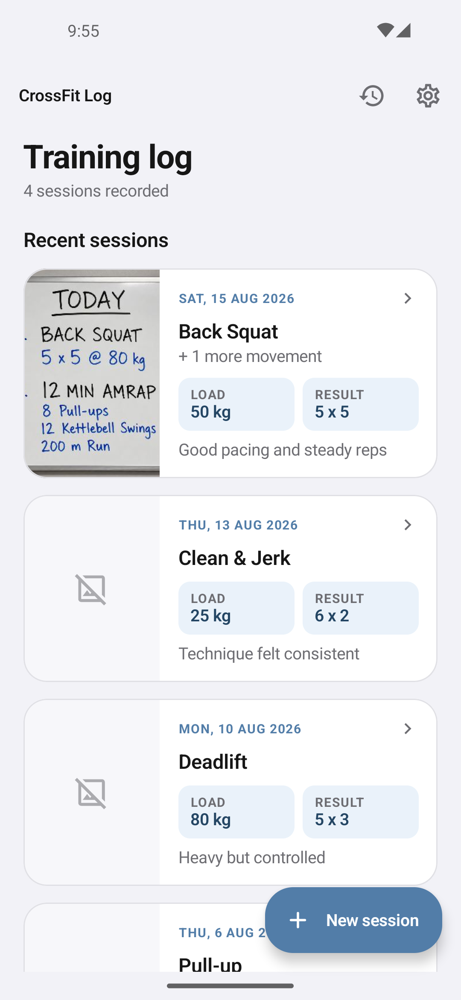
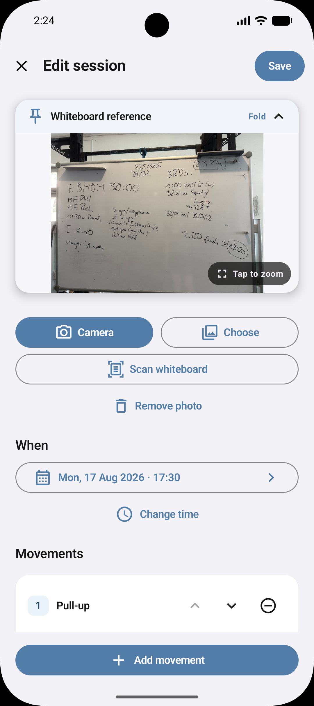
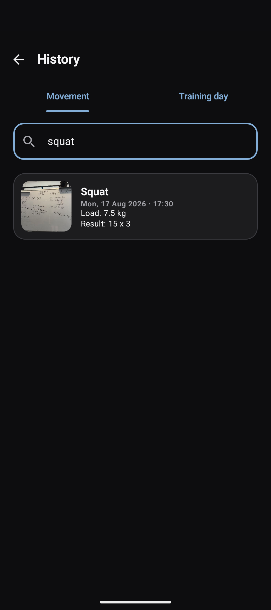
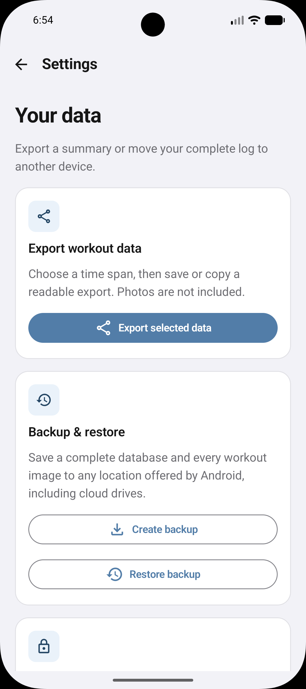

# CrossFit Log

CrossFit Log is a private, offline Android workout journal. Record movements from a whiteboard, keep an optional photo visible while logging, search past training, and export or migrate your data.

There are no accounts, ads, analytics, servers, or network permission. Live workout data stays in an app-private SQLite database.

## Screenshots

<table>
  <tr>
    <td align="center"><strong>Session list</strong></td>
    <td align="center"><strong>Session editor</strong></td>
  </tr>
  <tr>
    <td></td>
    <td></td>
  </tr>
  <tr>
    <td align="center"><strong>History search</strong></td>
    <td align="center"><strong>Export and backup</strong></td>
  </tr>
  <tr>
    <td></td>
    <td></td>
  </tr>
</table>

## Use the app

### Record a session

1. Tap **New session**.
2. Take or choose an optional whiteboard photo.
3. Enter one or more movements. Load, result, and notes are optional.
4. Tap **Save**.

The whiteboard photo stays pinned while the form scrolls. Tap **Fold** to collapse it temporarily, or tap the photo for full-screen pinch zoom and pan. Saved movement names are suggested in later sessions, including close fuzzy matches.

### Find and edit training

- Open **History → Movement** to search by movement name. Search ignores case, punctuation, spacing, and one-character mistakes in longer terms.
- Open **History → Training day** to select a date and see every session from that day.
- Open a session to review it. Tap **Edit** to change movements, date, notes, or photo, or to delete the session.

### Export or move data

Open **Export, backup & settings**:

- **Selected data (`.json`)**: choose 4 weeks, 12 weeks, this year, a custom range, or complete history. Save or copy readable workout data. Photos are excluded.
- **Backup (`.zip`)**: uses Android's system document picker to save a complete, checksummed database snapshot plus original photos and thumbnails to local storage, Google Drive, OneDrive, or another document provider. Restore validates the whole archive and then replaces the current log atomically.

Export a migration backup before uninstalling the app because Android may erase private app data.

## Storage and privacy

- Sessions and movements: Room-managed `crossfit-log.db` SQLite database in app-private storage.
- New whiteboard photos: JPEG, aspect ratio preserved, maximum dimension **1920 px**, quality **84%**.
- Thumbnails: JPEG, maximum dimension **480 px**, quality **78%**.
- Replacing, removing, or deleting a photo removes the app-managed files after the database change succeeds.
- Previously stored and restored full photos are not recompressed automatically.

## Developer setup

Requirements:

- Android Studio 2026.1 or newer
- Android SDK 37
- Android Studio's bundled JDK
- Android 8.0/API 26 or newer device or emulator

Open the repository in Android Studio, let Gradle sync, select the `app` configuration, and run it. Camera access is requested only when taking a photo; the system Photo Picker does not require broad media access.

Command-line checks:

```sh
./gradlew testDebugUnitTest assembleDebug lintDebug
./gradlew connectedDebugAndroidTest
```

The debug APK is written to `app/build/outputs/apk/debug/app-debug.apk`.

## Architecture

- Kotlin and Jetpack Compose UI
- Room/SQLite persistence with session and movement tables
- CameraX camera capture and Android Photo Picker import
- App-private JPEG photo and thumbnail storage
- Storage Access Framework export and restore
- Versioned, validated ZIP migration format

Room schema snapshots are checked into `app/schemas`. Update the database version and provide a migration whenever stored tables or columns change.
