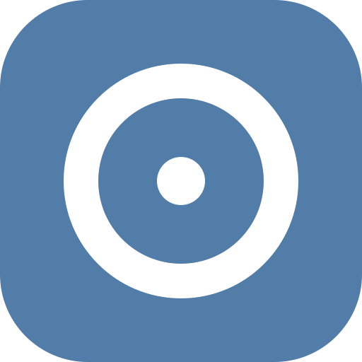
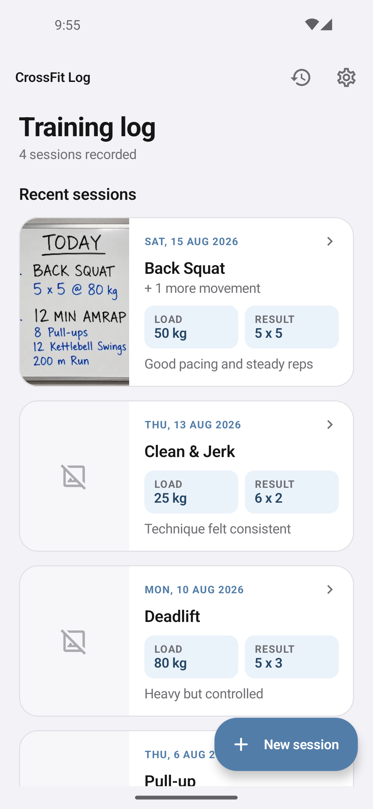
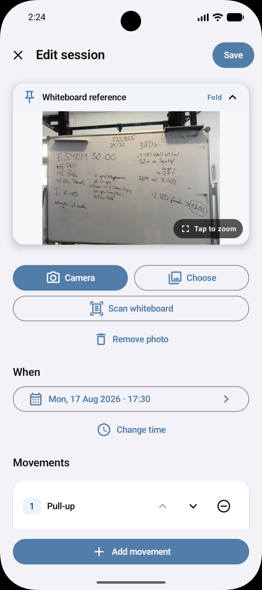
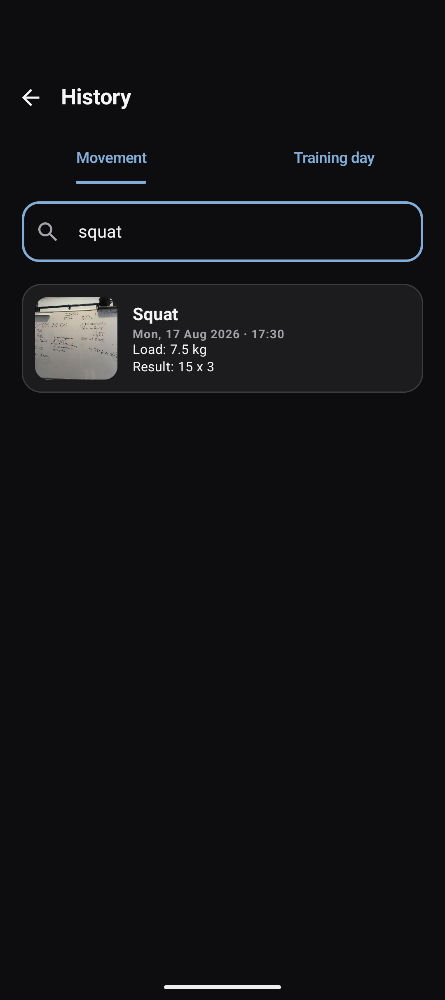
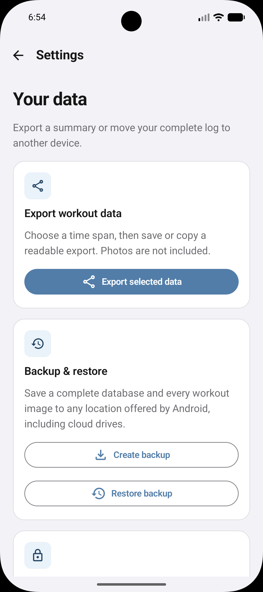

  

<h1 align="center">CrossFit Log</h1>

  A private, offline workout journal for Android.

  
  

CrossFit Log is a training journal for CrossFit and functional fitness. Take a photo of the gym whiteboard, let the app pick out the movements, add your loads and results, and look back at any movement or training day later. Everything stays on your phone: no account, no ads, no analytics, and no internet access.

> **Working on the code?** See the [developer guide](docs/DEVELOPMENT.md).

## Screenshots

<table>
  <tr>
    <td></td>
    <td></td>
  </tr>
  <tr>
    <td></td>
    <td></td>
  </tr>
</table>

## Install

You need an Android phone or tablet running **Android 8.0 or newer**.

1. On your phone, open the [latest release](https://github.com/xichen-de/crossfit-log-android/releases/latest) and download `crossfit-log-<version>.apk`.
2. Open the downloaded file. If Android asks, allow your browser or file manager to install apps.
3. Open **CrossFit Log** from your app drawer.

Optional: each release also includes a `SHA256SUMS` file. You can check that your download matches it before installing.

**Updating:** install a newer APK over the old one. Your sessions and photos are kept.

## Using the app

### Log a session

1. Tap **New session**.
2. Optional: add a whiteboard photo with **Camera** or **Choose**. The photo stays pinned at the top of the editor as a reference while you type; tap it to zoom.
3. Tap **Scan whiteboard** to get movement names suggested from the photo. Untick any you didn't do, then tap **Add selected**.
4. For each movement, fill in the **name**; **load**, **result**, and a **note** are optional. The fields accept any text, for example `60 kg`, `blue band`, `5-5-3-3-1`, `12:34`, or `7 rounds + 18`.
5. Adjust the date and time under **When** if you're logging a past session, add a session note, and tap **Save**.

As you type a movement name, the app suggests matching names from its built-in catalog and from movements you've logged before. Tap a suggestion to use it, which keeps your history consistent ("Pull-up" instead of "pullups" one day and "Pull up" the next).

### Scan tips

Scanning works entirely on your phone and only suggests movements it's confident about. You always review the suggestions before anything is added.

- Fill the frame with the board, straight on, in good light, without glare.
- Clear, printed-style handwriting works best.
- The scanner only recognises movement **names**, from the built-in catalog and your own history. Weights, rep schemes, and times aren't read, so type those yourself.
- If a custom movement isn't suggested, add it by hand once. Later scans can then recognise it.

### Review your training

- **Home screen:** your sessions, newest first. Tap one to see every movement, the whiteboard photo, and your notes.
- **History → Movement:** search a movement ("squat", "clean") to see every time you did it, with load and result, newest first.
- **History → Training day:** browse by date. The arrows jump to the previous or next day you trained; tap the date to pick any day.

From a session you can:

- **Edit** it, or delete it (at the bottom of the editor).
- **Duplicate** it to start today's session from the same movements. The photo isn't copied.
- **Share** it as a JSON file through any app, for example a messenger or an AI assistant.

## Export and backup

Open **Settings** (gear icon on the home screen). There are two different tools, for two different jobs:

| | **Export workout data** | **Create backup** |
|---|---|---|
| Use it to | Analyse or share your training, e.g. in a spreadsheet or with a coach or AI assistant | Move to a new phone, or keep a safety copy |
| Contains | Sessions in a chosen time span: dates, movements, loads, results, notes | Everything: all sessions and all whiteboard photos |
| Format | Readable JSON file, or copied to the clipboard | `.zip` archive, only readable by this app |
| Can be restored into the app? | No | Yes |

Export time spans: last 4 weeks, last 12 weeks, this year, a custom date range, or your complete history.

### Back up regularly

The app deliberately turns off Android's automatic cloud backup so your data never leaves the device without you choosing to send it. That also means **nothing is backed up unless you do it yourself**:

- Tap **Create backup** and save the file somewhere safe. The Android file picker also offers cloud drives such as Google Drive, if you have them installed.
- **Always create a backup before you uninstall the app, reset your phone, or switch phones.** Uninstalling deletes all sessions and photos.

### Restore a backup

**Restore backup** replaces **all** current sessions and photos with the ones in the backup; it doesn't merge them. The file is fully checked before anything is changed, so a damaged or wrong file leaves your current data untouched.

To move to a new phone: create a backup on the old phone → install the app on the new phone → **Settings → Restore backup** → pick the file.

## Privacy

- The app has **no internet permission**. It can't send data anywhere, and every release build is checked for this automatically.
- Whiteboard scanning uses an on-device text-recognition model. Photos are never uploaded.
- The camera permission is only requested when you tap **Camera**. You can pick photos from your gallery instead.
- Your data leaves the phone only when you export, share, or back up, and only to the destination you pick.

## Troubleshooting

**"App not installed" or "package conflicts" when updating.** The APK you downloaded was signed with a different key than the installed app, for example if you built it yourself. Back up, uninstall, install the new APK, and restore.

**The camera doesn't open.** Camera access was denied. Allow it in Android **Settings → Apps → CrossFit Log → Permissions**, or use **Choose** to pick a photo instead.

**The scan finds nothing.** Retake the photo closer and in better light, or add the movements manually. See [scan tips](#scan-tips).

**Restore says the backup is invalid or corrupted.** Only `.zip` files made by **Create backup** can be restored. JSON exports can't. If the file was copied through a cloud drive, download it again, fully, and retry.

**Found a bug or have an idea?** Please [open an issue](https://github.com/xichen-de/crossfit-log-android/issues).

## License

CrossFit Log is available under the [MIT License](LICENSE).
